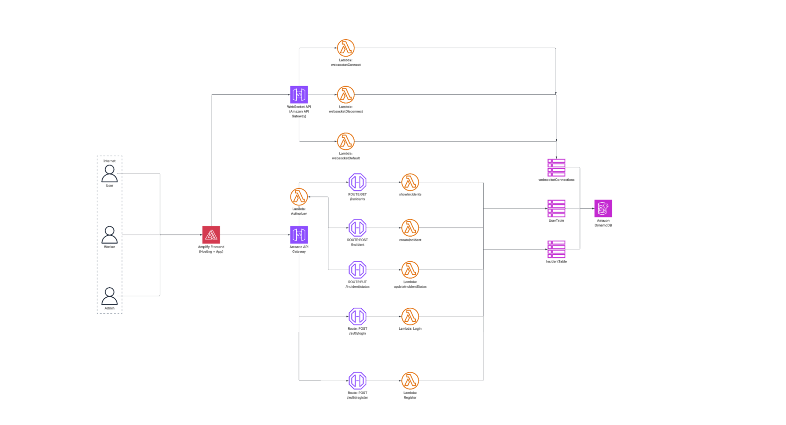

# 🧩 Sistema de Gestión de Incidentes — Arquitectura de Solución

Metarepositorio que integra **hack-back** (backend) y **hack-front** (frontend) para una plataforma completa de **reporte y gestión de incidentes**, diseñada para la Hackathon.

Incluye autenticación JWT, manejo de roles, creación y administración de incidencias, notificaciones en tiempo real con WebSockets y una interfaz moderna construida en React.

---

# 🏗️ Arquitectura General

En la raíz del proyecto se incluye el diagrama completo de la solución:

<p align="center">
  
</p>

La arquitectura se basa en **dos repositorios principales** incluidos como metarepos:

* **hack-front** → Aplicación web en React + Vite.
* **hack-back** → Backend serverless en AWS (API Gateway + Lambda + DynamoDB + WebSocket).

Ambos repos viven dentro de este metarepo para facilitar despliegue, documentación y coordinación del sistema.

---

# 🔧 Componentes Principales

## 1. Frontend — `hack-front`

Aplicación SPA en **React 19 + Vite + TS**, usando **Context API** para la autenticación y **React Router 7** para las rutas protegidas.

### Funcionalidades

* Registro e inicio de sesión.
* Guardado de usuario (`hf_user`) y token (`hf_token`) en localStorage.
* Dashboard dinámico con:

  * Panel de incidencias (SlideOver).
  * Formulario inline para reportar incidentes.
  * Gestión de trabajadores (solo Admin).
* Decodificación del JWT para obtener rol, email, departamento.
* Integración con backend vía variables de entorno.

### Rutas

| Ruta         | Protección | Descripción      |
| ------------ | ---------- | ---------------- |
| `/`          | Pública    | Landing          |
| `/login`     | Pública    | Iniciar sesión   |
| `/register`  | Pública    | Crear cuenta     |
| `/dashboard` | Protegida  | Panel principal  |
| `/post`      | Protegida  | Crear incidencia |

### Variables .env

```env
VITE_AUTH_BASE=https://tu-backend.com/api/auth
VITE_INCIDENT_BASE=https://tu-backend.com/api/incidents
```

---

## 2. Backend — `hack-back`

Backend construido en Node.js + Serverless Framework, sobre AWS:

### Servicios usados

* **API Gateway (REST)**: auth, incidencias.
* **API Gateway (WebSocket)**: notificaciones en tiempo real.
* **Lambda Functions**: lógica de negocio y seguridad.
* **DynamoDB**: persistencia total de usuarios e incidentes.

### Autenticación

* JWT firmado con `JWT_SECRET`.
* Login / Register.
* Rutas protegidas con Bearer Token.
* Roles disponibles: `User`, `Worker`, `Admin`.

### Tablas DynamoDB

#### UserTable

| Campo      | Descripción       |
| ---------- | ----------------- |
| UID (PK)   | ID único          |
| email      | Único             |
| username   | Identificador     |
| password   | Hash              |
| role       | user/worker/admin |
| department | IT, Cleaner, etc. |

#### IncidentTable

| Campo          | Descripción                                    |
| -------------- | ---------------------------------------------- |
| UID (PK)       | incidentId                                     |
| createdAt (SK) | timestamp ISO                                  |
| createdBy      | UID del creador                                |
| category       | tipo                                           |
| place          | ubicación                                      |
| urgency        | low/medium/high                                |
| status         | reported, assigned, working, solved, cancelled |

---

# 🚨 Flujo Completo de Funcionalidades

## 1. Registro de Usuario

Envías email, username, password, role y department.
Se valida y se crea un UID único.

## 2. Login

Devuelve un **JWT** con los claims:

* `userId`
* `email`
* `role`
* `department`

El frontend guarda el token en `hf_token`.

## 3. Crear Incidente

El usuario autenticado envía:

* category
* place
* description
* urgency

Se guarda en DB con estado inicial **reported**.

Se envía broadcast WebSocket a todos los clientes conectados.

## 4. Ver Incidentes

Endpoint que devuelve todos los incidentes.
Frontend soporta distintos formatos (`items`, `data/meta`, `incidents`).

## 5. Cambiar Estado

Según rol:

### User:

* Solo cancelar **sus** incidentes.

### Worker:

* Puede mover `reported → assigned → working → solved`.

### Admin:

* Cualquier transición válida.

### Reglas:

* No se puede retroceder.
* solved y cancelled son finales.
* Todas las actualizaciones disparan WebSocket.

---

# 🔌 WebSocket en Tiempo Real

Cuando se crea o actualiza un incidente:
→ Se envía un mensaje a todos los clientes conectados.
→ El dashboard se actualiza automáticamente.

Frontend maneja conexión y escucha eventos.

---

# 🗂️ Estructura del Metarepo

```
/ (root)
 ├── diagrama.webp
 ├── hack-front/   # App React
 └── hack-back/    # Backend Serverless AWS
```

---

# ▶️ Cómo Ejecutar Todo

## Frontend

```sh
cd hack-front
npm install
cp .env.example .env.local
npm run dev
```

## Backend

```sh
cd hack-back
npm install
echo "JWT_SECRET=TuClave" > .env
serverless deploy --stage test
```

---

# 🧪 Pruebas Manuales

* Registrar usuario → Redirige a dashboard.
* Login → Guarda hf_token y hf_user.
* Crear incidente → Aparece en SlideOver.
* Cambiar estado → Notificación WebSocket.
* Admin → Registrar trabajadores.

---

# 🚀 Objetivo del Sistema

Proveer una plataforma completa para **reportar, monitorear y administrar incidentes** dentro de una organización, con actualizaciones en tiempo real y jerarquía de permisos.

---
